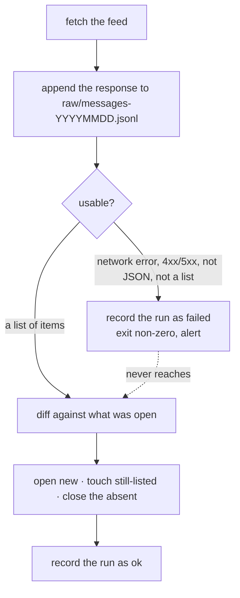

# 01. A feed that is not about lifts
*~7 min read · PR #1 · 8 to 18 August 2026*

*Where we are:* nothing exists yet. This chapter is the collector: what it writes down, in what
order, and the one property everything else depends on.

## The question that opened this stretch

Irish Rail's realtime endpoint is one URL:

```
GET https://connect.irishrail.ie/realtime/messages?lang=en
```

It returns a flat list of every service message currently on display. Ask it now and you get
whatever is up now. Ask it in an hour and you get whatever is up then. There is no history, no
archive, no "show me last week". The only way to know how long a lift was out is to have been
watching.

So the first question is not "how do I model a lift outage". It is "what exactly do I write
down, so that when I get the model wrong I can fix it without losing anything".

## What changed

### Write it down before you read it

Every run appends one line to `raw/messages-YYYYMMDD.jsonl`. The line is written **before any
parsing happens at all**, and it is written whether the run succeeded or failed. A run that got
a 403 writes a line saying it got a 403. A run whose response was not valid JSON writes the
bytes it got.

Everything else - the SQLite database, the site, the day bars, the grade - is derived from
those files and can be deleted at any time. `rebuild` replays the log from the beginning
through the same code path a live run uses, and reproduces the database exactly. The test that
matters most in the repository does precisely that: it drives a realistic history through the
live path (opens, updates, a close, a failed run that must change nothing, a reopen, a
duplicate, a schema drift), wipes the database, rebuilds from the log alone, and asserts the
two are identical.

> **Concept: source of truth against derived index.** Two kinds of file live in this project.
> The **log** is what the feed actually said, byte for byte, with a timestamp. It is appended
> to and never edited. The **database** is a convenience: a fast, queryable summary of what the
> log means under today's understanding of it. The distinction earns its keep the first time
> the understanding is wrong. If the code that decides "these two notices are the same outage"
> has a bug, fixing it does not mean going back and correcting records: it means fixing the
> code and replaying the log. The interpretation is disposable and the observation is not. The
> water site made the opposite call, for a reason chapter 03 touches on, and pays for it with a
> rewrite whenever an interpretation changes.

One line of that machinery is load-bearing in a way that is easy to miss. Every raw line is
written with `json.dumps(..., sort_keys=True)`. Because the keys are always in the same order,
the same observation written by two different machines produces byte-identical text, so two
collectors' logs can be merged with `sort -u` and the duplicates simply vanish. That is the
whole of the multi-machine story, and it is one keyword argument.

### The feed is not a lift feed

This is the first data-shape trap, and it shapes everything after it. The endpoint is not
"lift outages". It is every service banner Irish Rail is currently showing: delays,
cancellations, "Station currently closed", engineering works, and lifts. As of 31 August 2026
the database holds 234 distinct messages, of which **24 are about a lift or an escalator**
(22 lifts, 2 escalators). The other 210 are noise for this project's purposes.

The collector does not care. It records all 234, because deciding what counts as a lift notice
is an interpretation, and interpretations belong downstream where they can be changed. The
site's `classify` function picks out heads matching `Lift(s) out of order|service` and
`Escalator(s) out of order|service`, and if that pattern turns out to miss something, the
missed notices are already on disk.

There is a second category, and it is the useful kind of mess. 264 items in the log are
**unidentifiable**: they have an empty `locationCodes`, so there is nothing to attach them to.
Every one is a delay notice about a service rather than a place. They are stored in their own
table rather than discarded or forced into the main one, so a future question about delays has
data to work with, and a present question about lifts is not polluted by them.

### There is no id, so identity has to be derived

The feed gives each message no identifier. Poll twice and you get two lists of prose, with no
way to know which entry in the second is "the same" as an entry in the first.

Identity is therefore constructed: `head` plus the sorted `locationCodes` plus `start`. Three
fields that between them are stable for as long as Irish Rail does not touch the notice.

The failure mode is exactly what you would expect. If somebody edits the wording, or corrects
the start time by five minutes, the derived key changes, and to the collector that looks like
one message closing and an unrelated new one opening in the same poll. That limitation was
known and accepted on day one rather than engineered around, on the grounds that the raw
responses are kept forever: if it ever matters, the log can be reprocessed with smarter
matching. Chapter 02 is where it starts to matter, and where the site folds those pairs back
together.

### There is no completion signal either

Each message carries an `end` field, and in almost every message observed it is a placeholder
near the end of the current calendar year. It is not a repair estimate. It is not a promise. It
is a value somebody has to put in a form.

So there is exactly one signal for "this is over": **the notice was in one successful run and
is absent from the next**. That is a weaker statement than "the lift is fixed", and the site
never upgrades it. The word used on every page is "no longer listed".

### The invariant everything rests on

Here is the failure that would quietly ruin the entire dataset. A run fetches the feed. The
network is down, or the API key has been rotated, or the response is an HTML error page. The
code parses it as best it can, gets an empty list, and concludes that nothing is listed, so
every currently-open notice must have been fixed at 03:30 on a Tuesday.

That would not crash. It would not log an error. It would produce a database that looks
plausible and is wrong, and the corruption would be invisible until somebody noticed a page
claiming eleven lifts were repaired simultaneously.

> **Concept: a run that failed is not a run that saw nothing.** These are two completely
> different observations and a status site has to keep them apart. "I asked and there were no
> lift notices" is evidence. "I asked and could not get an answer" is the absence of evidence,
> and treating it as the first one closes every open outage at once. The distinction has to
> survive every future edit by somebody who has forgotten it, which means it cannot be a
> runtime check that a later refactor could route around. In `poll.py` it is structural: every
> failure path returns before reaching `diff_and_update_messages`, the single function that can
> change a message's open or closed status. A failed run cannot reach the code that closes
> things, so it cannot close things. The module docstring says so at the top, in those words.

The same function classifies a live response and a replayed one, so a live run and a `rebuild`
can never disagree about what a given response meant. Runs are recorded with an outcome, and
everything the site measures is bounded by the last run whose outcome was `ok`. As of 31 August
2026 that is 1,081 `ok` runs out of 1,084, with 3 `unreachable`.

### Worked example: what one run actually does



The dotted line is the chapter. Everything else is bookkeeping.

## Where it left the site

A Raspberry Pi running one command every 30 minutes, a log that grows by about 2.9 MiB a
month, and a database that can be thrown away. Coverage as of 31 August 2026 runs from
2026-08-08T21:30Z, unbroken except for three unreachable runs. The alerting is an ntfy topic
on a phone, because the API key is Irish Rail's and can be rotated without notice, and a
collector that fails silently is worse than no collector.

What none of this does yet is say anything. Twenty-four outages sit in a table with start
times that turn out to be nearly useless, and that is chapter 02.

## Notes

- PR #1, "Add Irish Rail lift-status collector" (18 Aug 2026): the module layout, the raw-first
  ordering, `tests/test_rebuild.py`, the systemd units and the ntfy alerting.
- `lift_status/poll.py` module docstring: the structural failure-path property, quoted above.
- `lift_status/store.py:write_raw`: `json.dumps(..., sort_keys=True)`, and `CLAUDE.md` § The
  invariant on why it is load-bearing.
- `README.md` §§ How it works, Storage, Known limitations: derived identity, the `end`
  placeholder, the accepted identity-drift limitation.
- Measured 31 Aug 2026 against `../lifts-data`: 234 messages, 24 classifying as lift or
  escalator (22 lifts, 2 escalators), 264 unidentifiable items, 1,084 runs of which 1,081 ok
  and 3 unreachable, coverage from 2026-08-08T21:30:55Z, raw log 2.9 MiB.
- Sibling contrast: the water site's archive is its database (uisce series ch 1); the power
  site's feed purges an outage within hours of restoration, which is what forced a Pi there
  (esb series ch 1 and 2). This feed is patient, so the Pi here is inherited rather than
  derived.
